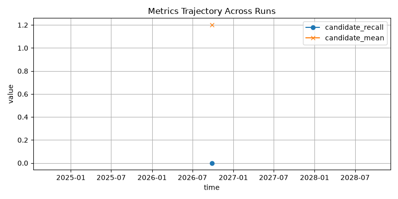

# Amazon ML Challenge 2026 — Project Workspace

## Kaggle one-command run

After cloning this repository in a Kaggle notebook with Internet enabled, run:

```bash
python kaggle_runner.py
```

The runner checks out the Git LFS dataset when needed, installs the pinned Python
requirements, discovers the train/test folders, runs the pipeline, validates both
TSVs, and creates `AMAZON_ML_TEAM_submission.zip`. The two leaderboard files are
written to `output/`; the ZIP contains the exact challenge package layout. In
Kaggle, a copy of the ZIP is also placed directly in `/kaggle/working/` for download.

The default run scores every test Source-1 entity against the full test Source-2/3
corpus. To keep model selection and final pair fitting within a typical Kaggle
session, it uses up to 5,000 stratified training entities for OOF selection and up
to 25,000 for the final pair model, limits per-channel candidates to 10% of the
pipeline defaults, and disables the memory-intensive optional cross-source target
graph. These defaults are configurable with `ER_SAMPLE_TRAIN_ROWS`,
`ER_FINAL_TRAIN_ROWS`, and `ER_DISABLE_TARGET_GRAPH`; set either row count to `0` to
use every labeled Source-1 training row. `ER_DATASET_DIR` can point to another
directory containing `train/` and `test/`. `ER_CHANNEL_LIMIT_MULTIPLIER` changes
the candidate cap; raising it can improve blocking recall at higher runtime and
output size.

Git LFS stores the provided 1.09 GB challenge archive. The runner extracts its seven
challenge TSVs automatically (about 2.4 GB unpacked), so Git does not store a second
copy of the extracted data. Public GitHub LFS downloads count against the repository
owner's monthly bandwidth allowance.

This workspace contains the challenge PDF and the provided dataset. The goal is to build a business entity resolution pipeline that matches records from Source 2 and Source 3 back to Source 1, using the training data and a validation split to tune the model before generating final test-set outputs.

## Repository layout

- `amazon_ml_challenge_2026.pdf` — official challenge brief
- `student_resource/` — extracted challenge starter package, including dataset and validator
- `docs/` — planning and execution notes for the solution

## Critical challenge facts

- Source 1 is the deduplicated reference source.
- Source 2 and Source 3 are noisy candidate sources.
- A Source 1 entity can have zero, one, or many matches from S2/S3.
- Output must be two TSV files in `output/`:
  - `matching_results.tsv`
  - `candidate_pairs.tsv`
- The validation script is:

```bash
cd student_resource
python3 utils/validate_submission.py \
  --matching output/matching_results.tsv \
  --candidate output/candidate_pairs.tsv \
  --test-dir dataset/test
```

- Evaluation metric is F_0.5 macro over Source 1 entities.
- Precision matters more than recall. False merges are costly.

## Immediate next steps

1. Read the official PDF and challenge README.
2. Explore dataset structure and label formats.
3. Create a validation split from training data.
4. Build a candidate-generation baseline.
5. Train a matching model using name + address features.
6. Optimize the decision threshold on validation data.
7. Generate final predictions for test data.
8. Validate outputs and package the final submission.

## Recommended working structure

```text
AMAZON_ML/
├── README.md
├── docs/
│   ├── 01_problem_brief.md
│   ├── 02_execution_plan.md
│   ├── 03_modeling_strategy.md
│   └── 04_submission_checklist.md
├── student_resource/
│   ├── dataset/
│   ├── utils/
│   ├── README.md
│   └── Documentation_template.md
├── output/
└── code/
```

This README is the launch point. The planning docs in `docs/` explain the exact work flow and success criteria.


<!-- RUNS_METRICS_START -->




| run_id | timestamp | candidate_recall | candidate_mean | total_seconds |
|---|---:|---:|---:|---:|
| 20260926T092300Z-65afb09d | 2026-09-26T09:23:54.400085+00:00 | 0.0000 | 1.2 | 0.1 |

<!-- RUNS_METRICS_END -->
